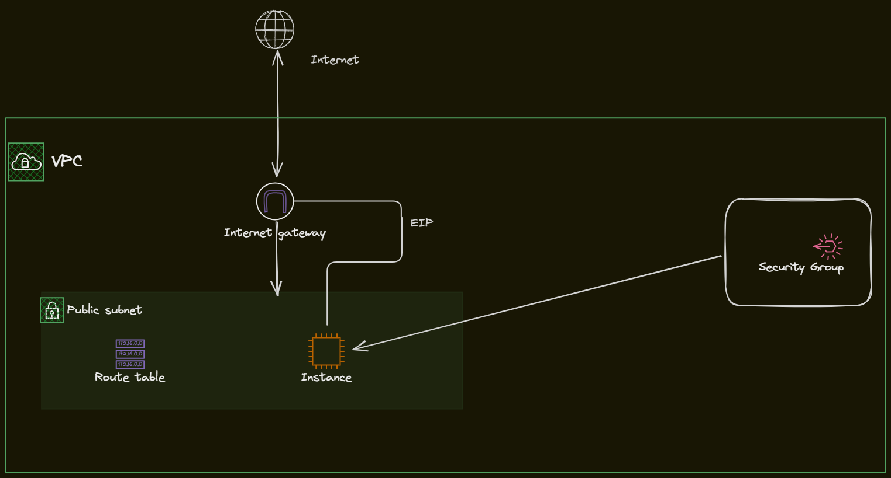
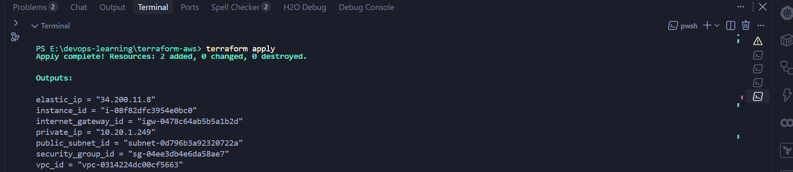
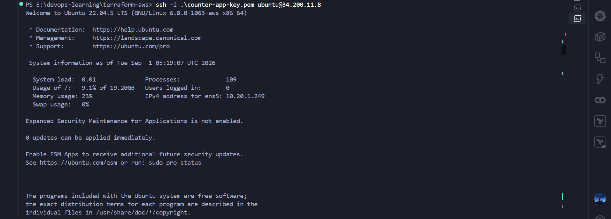

# Terraform - Amazon Web Services

The repository aims to explore the capabilities of Terraform in provisioning and managing AWS resources. It contains a collection of Terraform modules that can be used to create various AWS services and infrastructure components.

## Prerequisites

- Amazon Web Services (AWS) account
- Terraform
- Amazon CLI (optional)


## Module layout

```
main.tf / variables.tf / outputs.tf   — root, wires modules together
modules/network/    — VPC, public subnet, IGW, route table
modules/security/   — security group (22, 80, 443 in; all out)
modules/compute/    — AMI lookup, EC2 instance, Elastic IP, bootstrap script
k8s-manifests/       — copies of your uploaded YAML, embedded into the VM at boot
```

## Architecture


## To run the script

- Create a key pair using the command for ec2 instance

```
aws ec2 create-key-pair --key-name application-key --query 'KeyMaterial' --output text > counter-app-key.pem
```
- Use terraform init to initialize the working directory containing Terraform configuration files.
```
terraform init
```
- Check the configurations
```
terraform plan
```
- Apply the changes
```
terraform apply
```

- Log in to the instance using the command below

```
ssh -i <file_name>.pem ubuntu@<eip_address>
```
## Output




### Note: Never Forget to make the permission read only for the key pair file using the command below

Linux:
```
chmod 400 <file_name>.pem
```

Windows:
```
icacls.exe <filename>.pem /inheritance:r
icacls.exe .\counter-app-key.pem /grant:r "$($env:USERNAME):(R,W)"
```
```
