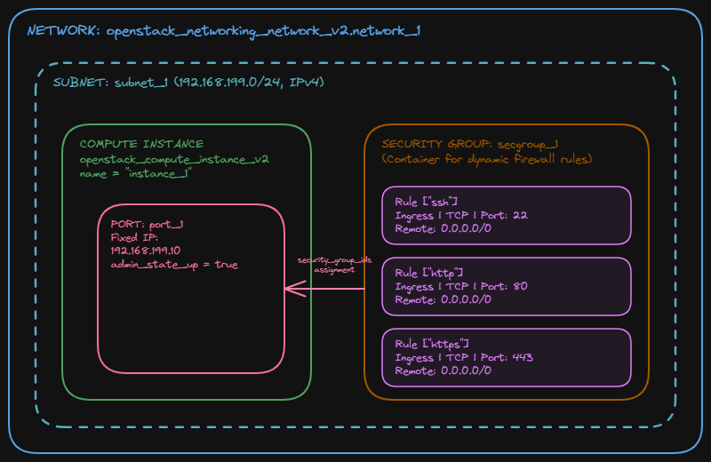
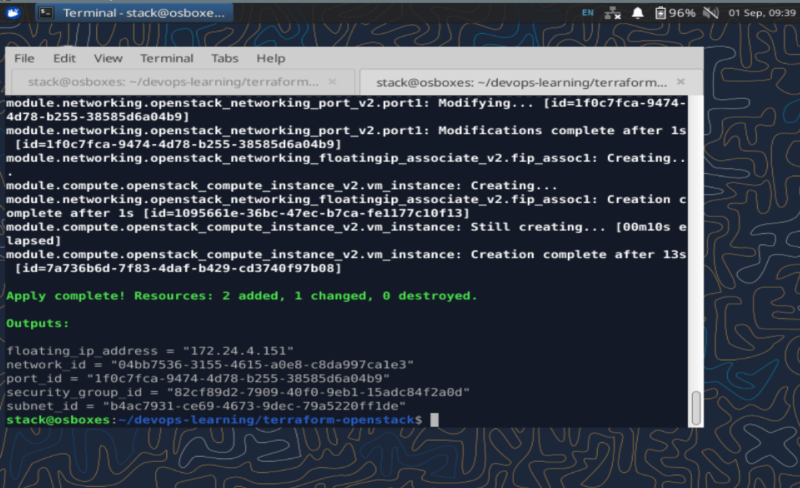
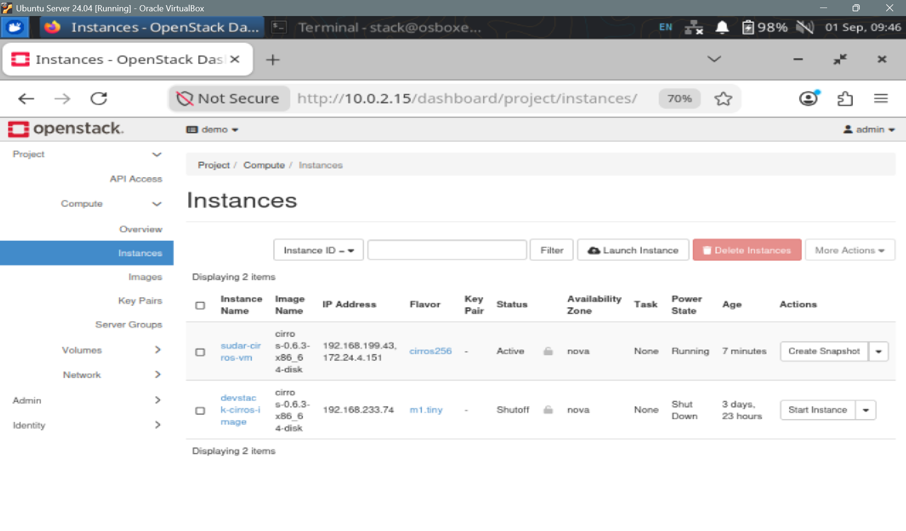
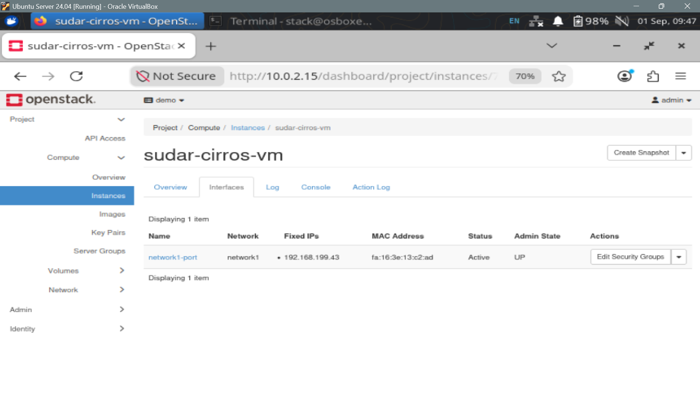
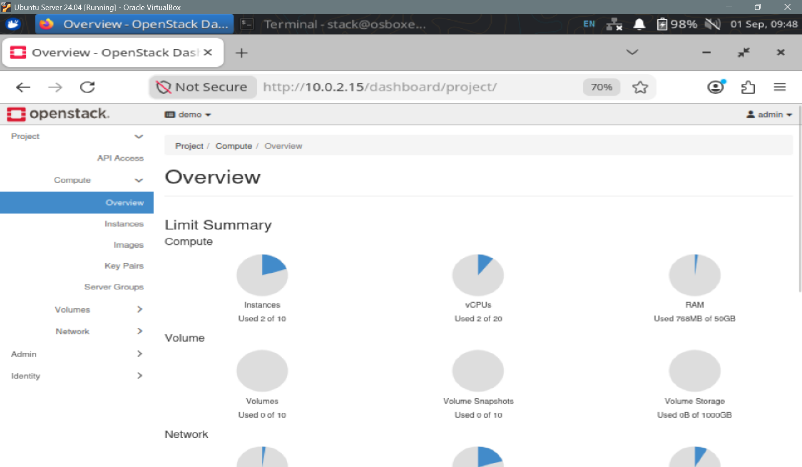
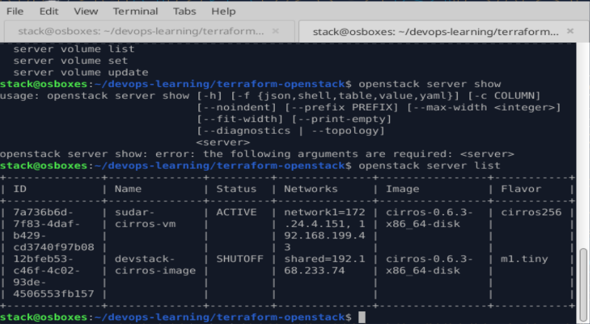

# Terraform - Openstack

The repository explores the capabilities of Terraform in provisioning and managing resources in OpenStack. It contains a collection of Terraform modules that can be used to create various Openstack components.

## Prerequisites

- OpenStack configuration with appropriate premissions
- Terraform

## Module layout

```
main.tf / variables.tf / outputs.tf   — root, wires modules together
modules/network/    —  Public and Private network, routers, floating IP and port (to attach the security rules)
modules/security/   —  security group (configure firewall rules, port level config done here)
modules/compute/    —  Compute instance (Cirros image used here), flavour configured here
```

## Architecture


## To run the script

- Use terraform init to initialize the working directory containing Terraform configuration files.

```
terraform init
```
- Check the configurations
```
terraform plan
```
- Apply the changes
```
terraform apply
```

## Output





